<div align="center">

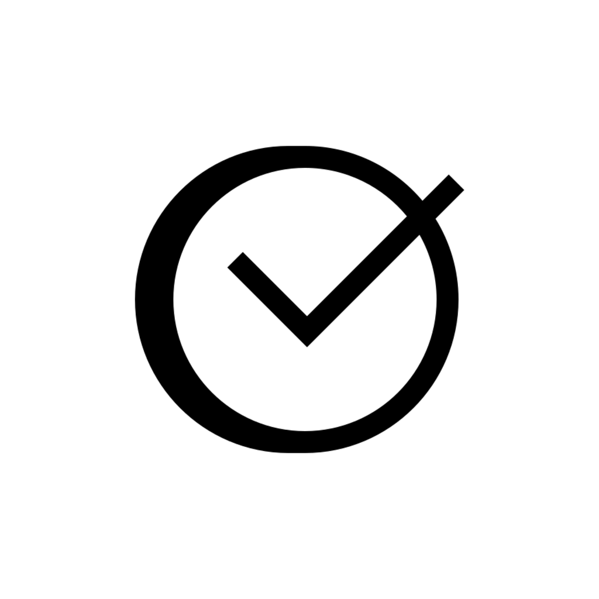

# Pidom

**A personal PDF reader that keeps your place across every device you own.**

Import documents, organise them into collections, read offline, and pick up on
your phone where you left off on your tablet.

[](https://docs.expo.dev)
[](https://reactnative.dev)
[](https://convex.dev)
[](https://www.typescriptlang.org)
[](LICENSE)

</div>

---

## Screens

<table>
<tr>
<td width="33%">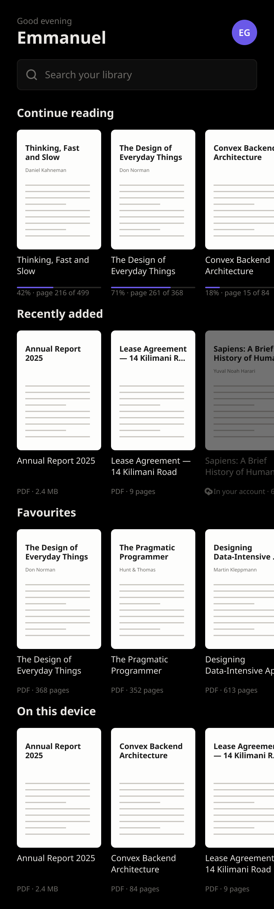</td>
<td width="33%">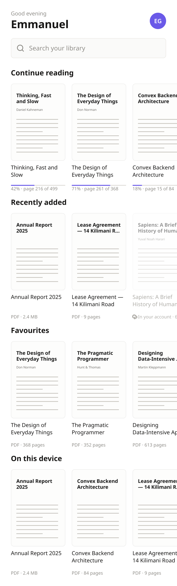</td>
<td width="33%">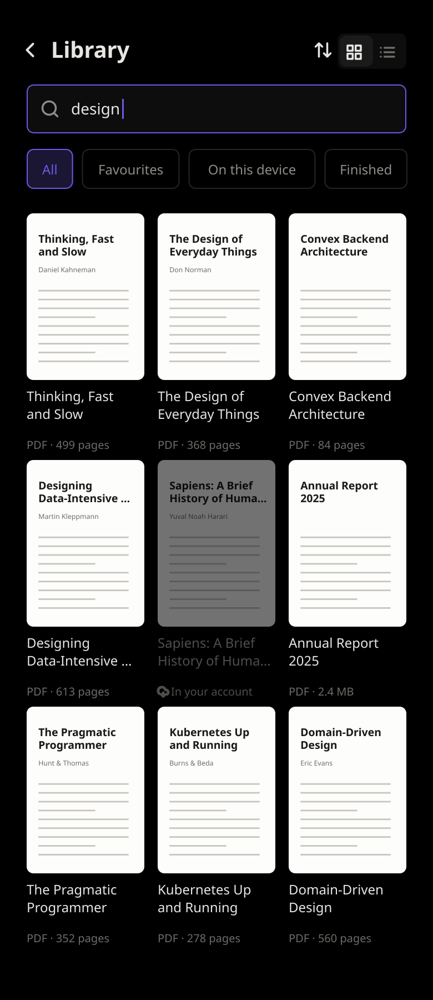</td>
</tr>
<tr>
<td align="center"><b>Home</b><br><sub>Rails of covers, no cards</sub></td>
<td align="center"><b>Light</b><br><sub>One token set, both themes</sub></td>
<td align="center"><b>All library</b><br><sub>Search, sort, filter</sub></td>
</tr>
</table>

<table>
<tr>
<td width="25%">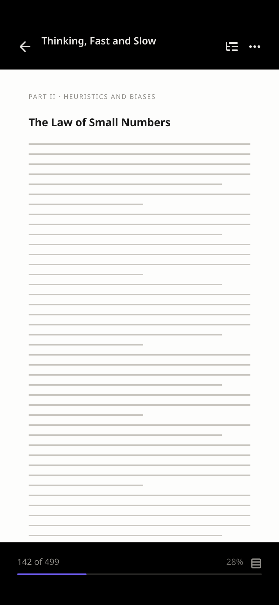</td>
<td width="25%">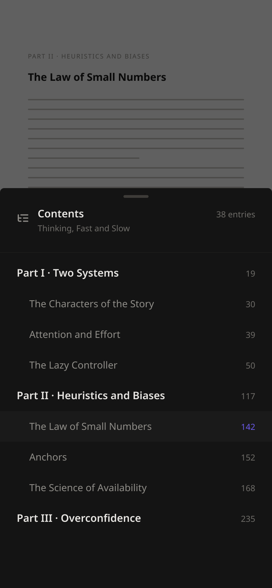</td>
<td width="25%">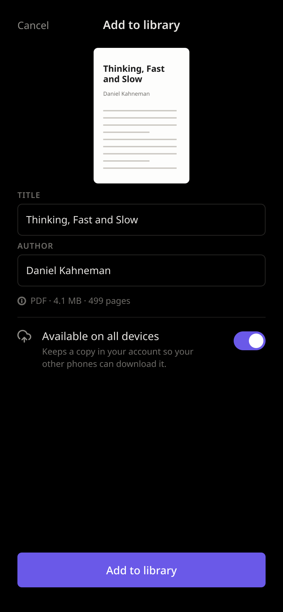</td>
<td width="25%">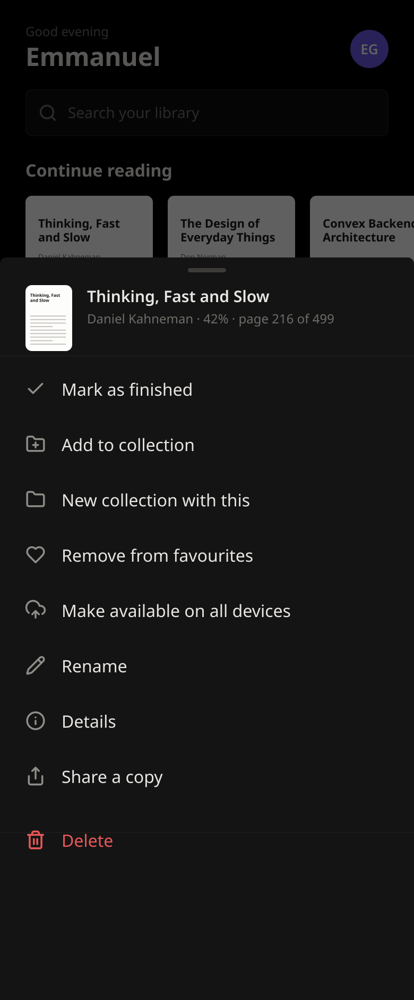</td>
</tr>
<tr>
<td align="center"><b>Reader</b><br><sub>Full-bleed, controls on tap</sub></td>
<td align="center"><b>Contents</b><br><sub>Read out of the PDF itself</sub></td>
<td align="center"><b>Import</b><br><sub>Real cover, sync decision</sub></td>
<td align="center"><b>Actions</b><br><sub>On long press</sub></td>
</tr>
</table>

<table>
<tr>
<td width="33%">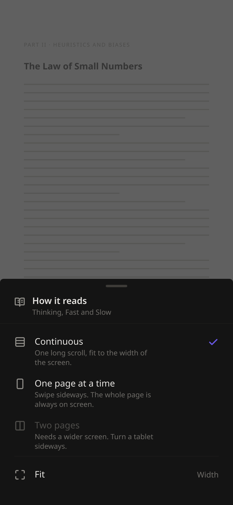</td>
<td width="33%">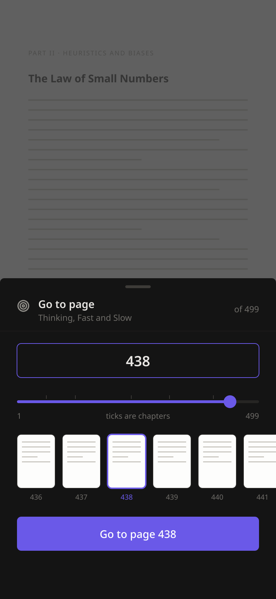</td>
<td width="33%">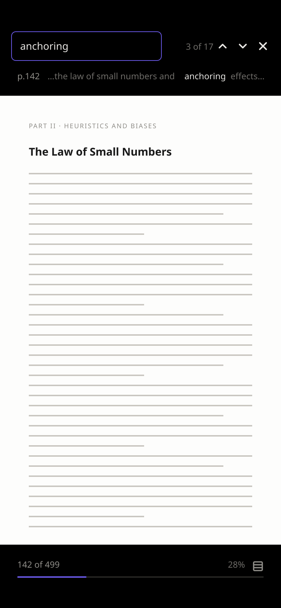</td>
</tr>
<tr>
<td align="center"><b>How it reads</b><br><sub>Continuous, one page, two pages</sub></td>
<td align="center"><b>Go to page</b><br><sub>Type it, or drag past the chapters</sub></td>
<td align="center"><b>Find</b><br><sub>Inside the page you are on</sub></td>
</tr>
</table>

<table>
<tr>
<td width="33%">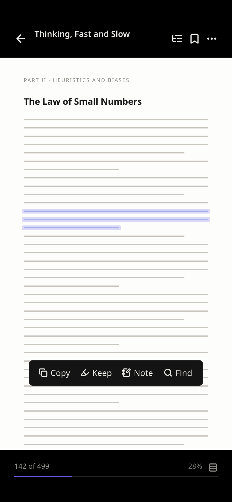</td>
<td width="33%">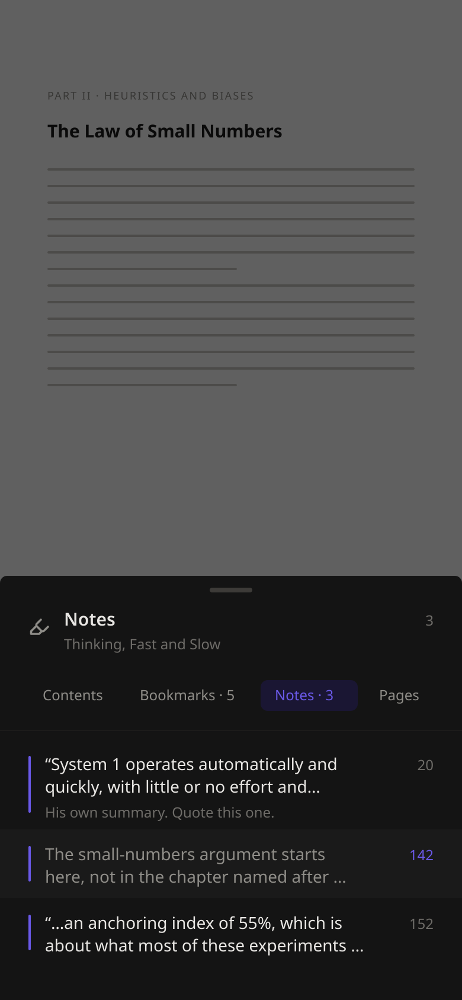</td>
<td width="33%">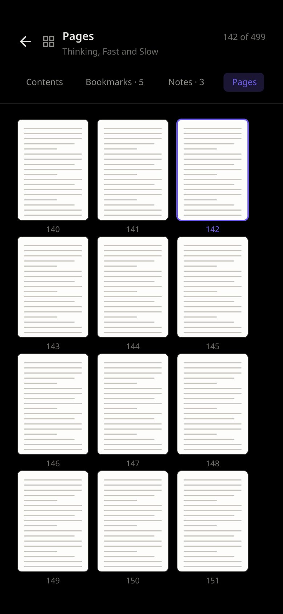</td>
</tr>
<tr>
<td align="center"><b>Selection</b><br><sub>Copy, keep, note, find</sub></td>
<td align="center"><b>Notes</b><br><sub>The passage, and what you made of it</sub></td>
<td align="center"><b>Pages</b><br><sub>Every page, three at a time</sub></td>
</tr>
</table>

<table>
<tr>
<td width="25%">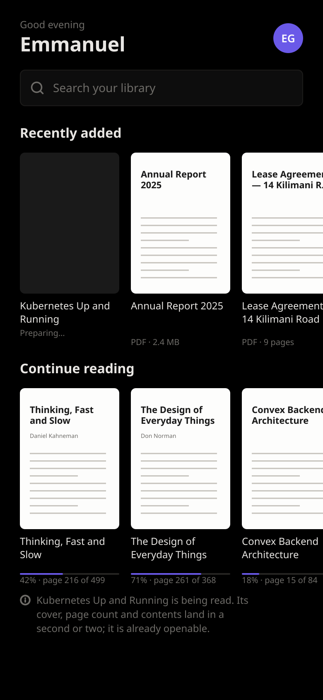</td>
<td width="25%">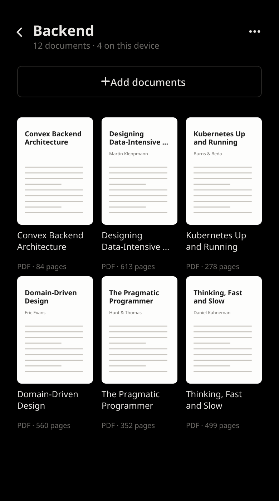</td>
<td width="25%">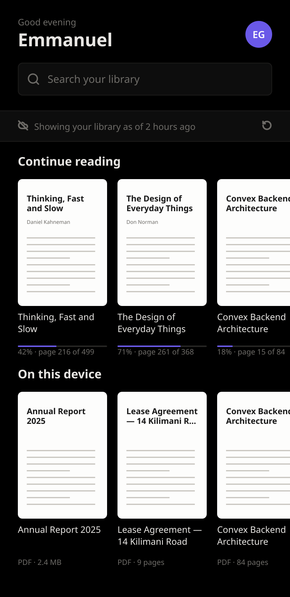</td>
<td width="25%">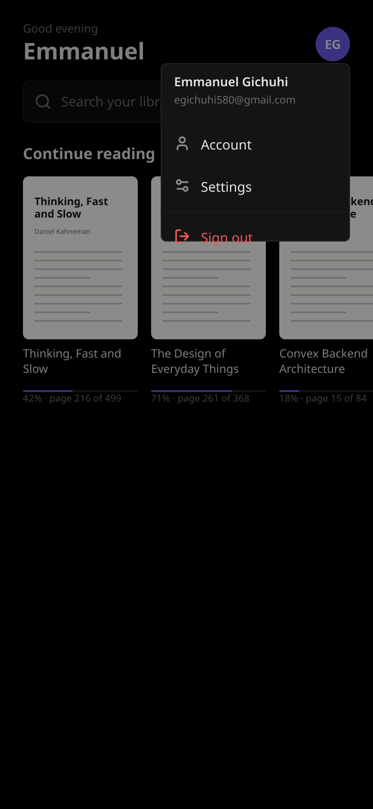</td>
</tr>
<tr>
<td align="center"><b>Processing</b><br><sub>In the library before its cover is</sub></td>
<td align="center"><b>Collections</b><br><sub>A relationship, not a copy</sub></td>
<td align="center"><b>Offline</b><br><sub>Last known library, dated</sub></td>
<td align="center"><b>Account</b><br><sub>From the avatar</sub></td>
</tr>
</table>

<table>
<tr>
<td width="33%">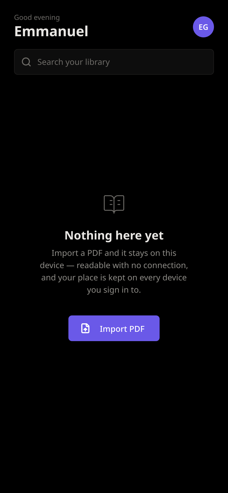</td>
<td width="33%">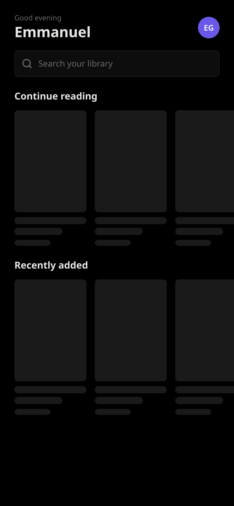</td>
<td width="33%">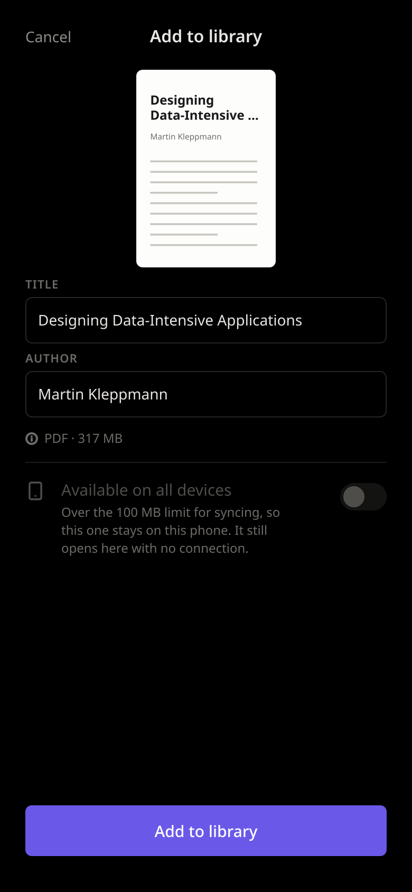</td>
</tr>
<tr>
<td align="center"><b>Empty</b><br><sub>One action, no placeholder cards</sub></td>
<td align="center"><b>Loading</b><br><sub>Real headings, unknown covers</sub></td>
<td align="center"><b>Too large</b><br><sub>Said before you commit</sub></td>
</tr>
</table>

## What it does

- **Import PDFs** from the system picker. One pass over the file yields the
  cover, the page count and the document's own table of contents — and refuses a
  file that is not really a PDF, or one with a password, before writing anything.
- **Jump by chapter.** The contents built into the PDF, if it has any.
- **Search inside** every document you have synced, and go straight to the page
  — with no connection too, from a copy of the text kept on the phone.
- **Open a PDF from anywhere.** Files, Drive, Mail: "Open with → Pidom".
- **Read offline — properly.** Not a fallback mode. The device has its own
  encrypted database and the library is read from it first, so Home, the reader,
  your notes and your place in a book never wait on a network. Import a PDF in
  aeroplane mode and it is a real document in a real library. Changes queue up
  in an outbox and reach your account when there is a connection.
- **See what it costs you.** Every document on the phone, largest first, and
  whether removing one costs a download or destroys your only copy.
- **Sync what is worth syncing.** Per document, up to 100 MB, to Cloudflare R2
  behind a signed URL that expires in five minutes.
- **Read it the way you want.** One long scroll, one page at a time, or two
  pages side by side on a screen wide enough for them. Pinch and double-tap zoom
  are the platform's own.
- **Get to page 438** by typing it, by dragging past the chapter marks, or from
  the contents — all three land in the same place.
- **Find a word inside the document you are reading**, without leaving the page.
  Works with no connection, from the copy of the text kept on the phone.
- **Mark a page** and come back to it. Bookmarks sit beside the contents.
- **Pick up where you left off.** The page is kept on the device as you read, so
  a force-quit costs you a paragraph rather than a chapter, and synced to your
  account on a debounce to drive Continue Reading everywhere else.
- **Organise** with collections and favourites. A collection is a relationship,
  never a second copy of the file.

## Stack

| | |
| --- | --- |
| **App** | Expo SDK 57, React Native 0.86 (New Architecture), Expo Router |
| **UI** | gluestack-ui v5, NativeWind v5, Tailwind v4 tokens |
| **Backend** | Convex — schema, queries, mutations, crons, Workflow, Workpool, Rate Limiter |
| **Auth** | Google Sign-In, verified by Convex as an OIDC provider |
| **Files** | Cloudflare R2 via `@convex-dev/r2`; PDFs on-device via `expo-file-system` |
| **Text** | `unpdf` (PDF.js) in a Convex Node action; `expo-sqlite` FTS5 on the device |
| **Lists** | FlashList v2 |

## Getting started

Native Google Sign-In needs custom native code, so **Expo Go will not work** —
you need a development build.

```bash
npm install
npx convex dev            # creates the deployment, writes convex/_generated
npx expo prebuild --clean
npx expo run:android      # or run:ios
```

There is more to set up than that: a Google OAuth client per platform, and a
Cloudflare R2 bucket if you want documents on more than one device.
**[docs/setup.md](docs/setup.md)** has all of it.

## Documentation

| | |
| --- | --- |
| [Setup](docs/setup.md) | Google, Cloudflare, environment variables, scripts |
| [Architecture](docs/architecture.md) | Where a PDF lives, syncing, offline, processing, search, the reader |
| [Security](docs/security.md) | Identity, ownership, and the reasoning behind both |
| [Design](docs/design.md) | Tokens, the type scale, and the design canvas |
| [Contributing](CONTRIBUTING.md) | How to propose a change |

## Status

Google sign-in, the library, importing with real covers and contents,
collections, favourites, offline reading, syncing to R2, searching inside synced
documents online and off, and a reader with three layouts, find-in-document,
bookmarks, direct page navigation, landscape and a screen that stays awake.
Highlights and OCR for scanned documents are not built yet.

## Licence

[MIT](LICENSE) © Telvin Teum
